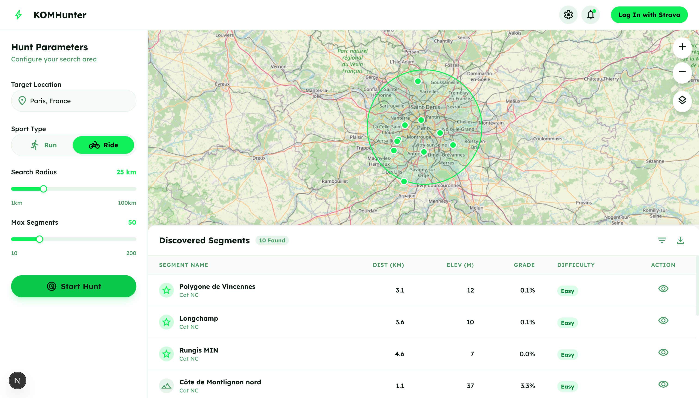
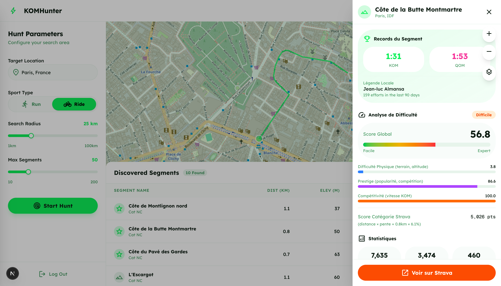

<div align="center">

# KOMHunter

**Find the Strava segments you can actually beat.**

[](https://www.python.org/)
[](https://fastapi.tiangolo.com/)
[](https://nextjs.org/)
[](https://bun.sh/)
[](LICENSE)

</div>

---

KOMHunter is a web app for Strava athletes who want to hunt KOMs/QOMs strategically. Log in with Strava, pick a location and a radius, and KOMHunter finds the segments around it, scores each one for difficulty, and shows you which crowns are within reach.

- **Segment hunting** — search segments around any location (geocoded via OpenStreetMap), filtered by sport (ride/run) and radius. Click the map or hit "Ma position" to recenter the search.
- **Terrain-first difficulty scoring** — every segment gets a 0-100 terrain difficulty score that is sport-aware (climb-oriented for riding, grade-adjusted effort for running). Popularity (prestige) and KOM speed (competitiveness) are shown *separately* — see [Difficulty scoring](#difficulty-scoring).
- **Advanced search** (`/search`) — filter by Strava climb category, average-grade range, and distance range, with a sortable results table.
- **Bike/run differentiation** — sport icons and color accents throughout (orange for riding, blue for running).
- **Training heatmap** — overlay your own activity tracks (decoded from Strava summary polylines) on the map, filterable by sport.
- **Map + table** — results appear as an interactive Leaflet map (segment polylines, markers, optional heatmap) and a sortable table.
- **Segment detail** — click any row (or a KOM/PR/starred card in the dashboard) for the full breakdown: distance, elevation, grade, KOM/QOM time, and the difficulty/prestige/competitiveness scores.
- **Deep links to Strava** — every segment links straight to `strava.com/segments/{id}` so you can star it and go hunt it.
- **Athlete dashboard** — your ride/run stats, current KOMs, PRs, and starred segments (all clickable through to segment detail).
- **Settings** (`/settings`) — default sport/radius preferences and notification opt-ins, saved locally in your browser.

| Hunt results | Segment detail |
|---|---|
|  |  |

## Architecture

Two services, one OAuth flow:

```
┌────────────────────┐         ┌─────────────────────┐         ┌─────────────┐
│  Next.js frontend  │  REST   │   FastAPI backend   │  HTTPS  │  Strava API │
│  localhost:3000    │────────►│   localhost:8000    │────────►│             │
│  (Bun, TypeScript, │         │  (Python 3.11+,     │         │  OAuth2 +   │
│   Leaflet map)     │         │   Pydantic v2)      │         │  segments   │
└────────────────────┘         └─────────────────────┘         └─────────────┘
                                        │
                                        └────► OpenStreetMap Nominatim (geocoding)
```

- **Frontend** (`frontend/`) — Next.js 16 + TypeScript + TailwindCSS, run with Bun. Three routes: `/` (simple hunt), `/search` (advanced filters), `/settings` (preferences). Renders the hunt form, Leaflet map (with an optional training heatmap via `leaflet.heat`), results table, segment detail panel, and athlete dashboard. Talks to the backend via a typed API client; Strava auth is shared across all routes.
- **Backend** (`backend/`) — FastAPI. Handles Strava OAuth, segment exploration (with optional climb-category / grade / distance filters), terrain-first difficulty scoring, geocoding, athlete data, and a training-heatmap endpoint. Interactive API docs at http://localhost:8000/docs.
- **Auth flow** — the backend performs the Strava OAuth2 dance, then wraps the Strava tokens in a signed **JWT session** returned to the browser (URL fragment). The frontend sends it as `Authorization: Bearer <JWT>` on every call. When the underlying Strava access token expires (~6 h), the backend refreshes it transparently and returns a new JWT in the `X-KOM-Refreshed-Token` response header, which the frontend stores — no re-login needed for the life of the session (7 days).

More detail: [CLAUDE.md](CLAUDE.md) (agent/developer reference) and [docs/ARCHITECTURE.md](docs/ARCHITECTURE.md) (original design doc).

## Difficulty scoring

KOMHunter scores every segment **terrain-first**. The headline **difficulty** (0-100) measures the physical ground only, and it is **sport-aware**:

- **Riding** — Strava climb points (distance × average grade) mapped to a curve, plus penalties for steep max grade and high altitude.
- **Running** — vertical gain, a grade-adjusted effort term (GAP-inspired), and distance.

Two context scores are computed but kept **separate** from difficulty (they are no longer summed in):

- **Prestige** — how popular/contested a segment is (efforts and unique athletes).
- **Competitiveness** — how fast the current KOM/QOM is versus a sport- and grade-adjusted norm.

Keeping these apart fixes the old bug where a short but popular urban ramp scored "hard". Read difficulty to judge the *terrain*, and prestige/competitiveness to judge how tough the *crown* will be to take. Implementation: [`backend/app/services/scoring.py`](backend/app/services/scoring.py).

## Quickstart

### Prerequisites

- **Python 3.11+**
- **[Bun](https://bun.sh/)** (the frontend uses Bun, not npm)
- A **Strava API application** (free — see [Strava app setup](#strava-app-setup) below)

### Setup

```bash
# 1. Clone
git clone https://github.com/Rqbln/KOMHunter.git
cd KOMHunter

# 2. Install backend (venv + pip) and frontend (bun install)
make install

# 3. Configure the backend
cp backend/.env.example backend/.env
# Edit backend/.env:
#   STRAVA_CLIENT_ID / STRAVA_CLIENT_SECRET  -> from your Strava API app
#   JWT_SECRET_KEY                           -> generate a strong one:
openssl rand -hex 32

# 4. Configure the frontend (defaults work for local dev)
cp frontend/.env.example frontend/.env.local

# 5. Start both services (backend :8000, frontend :3000)
make reboot
```

Open **http://localhost:3000**, click "Login with Strava", and start hunting.

### Strava app setup

1. Go to https://www.strava.com/settings/api and create an application.
2. Set **Authorization Callback Domain** to `localhost`.
3. Copy the **Client ID** and **Client Secret** into `backend/.env`.

Never commit `backend/.env` — it holds real secrets.

## Tests

```bash
# Backend unit tests (pytest)
cd backend && ./venv/bin/pytest

# Frontend lint + tests + build (Bun)
cd frontend && bun run lint && bun test && bun run build

# End-to-end smoke test (requires make reboot first)
bash scripts/smoke.sh
```

## Documentation

- [docs/README-dev.md](docs/README-dev.md) — detailed development setup (two-terminal workflow, Docker, env vars).
- [docs/ARCHITECTURE.md](docs/ARCHITECTURE.md) — original design document.
- [CLAUDE.md](CLAUDE.md) — canonical reference for AI coding agents (and a handy human cheat sheet).
- http://localhost:8000/docs — live OpenAPI/Swagger docs once the backend is running.

## License

MIT — see [LICENSE](LICENSE).
